# PromptArchitect AI 🧠📐

> **Autonomous Pre-Compilation Requirements & Prompt Orchestration Engine**  
> Transform vague natural human thoughts into mathematically rigorous, security-hardened, execution-ready specifications for autonomous AI coding agents.

[](LICENSE)
[](https://nodejs.org)
[](https://react.dev)
[](https://www.typescriptlang.org)
[](https://expressjs.com)
[](https://aistudio.google.com)
[](https://vercel.com)

---

## 📚 Complete Guides & Documentation

- **🚀 [Frontend ↔ Backend Setup & Integration Guide](FRONTEND_BACKEND_SETUP_GUIDE.md)**: Step-by-step master guide for connecting the React 19 / Vite frontend to Fastify 5.x & Supabase (Auth, proxying, quota, compilation, and production cutover).
- **🔍 [Frontend ↔ Backend Discovery Report](FRONTEND_BACKEND_DISCOVERY.md)**: Detailed discovery audit comparing existing frontend components against target v2.3 architecture.
- **⚡ [Backend Quick Setup Guide](setup.md)**: 60-second backend configuration guide with migration sequencing and cURL cheat sheets.

---

## 🌟 Overview: The "Architect Before the Builder" Philosophy

Autonomous coding agents (Google Antigravity, Cursor, Claude Code, v0) are extraordinarily powerful builders, but when given unstructured prompts like *"Build me an e-commerce website"*, they make unguided assumptions:
- Loose, untyped `any` schemas.
- Missing database migration steps & unindexed foreign keys.
- Lack of cryptographic replay protection and distributed idempotency.
- Blind code patching without terminal test verification or rollback checkpoints.

**PromptArchitect AI acts as the Principal Systems Architect**:
It ingests raw, natural language requests and runs them through a deterministic **7-Stage Compiler Pipeline**, generating watertight architectural blueprints (**Prompt A: PRD & Contract**) and step-by-step test-driven execution checklists (**Prompt B: Implementation Blueprint**).

```
┌─────────────────┐      ┌─────────────────────────┐      ┌───────────────────────────────┐
│  Raw Human Idea │ ───► │  PromptArchitect        │ ───► │  Verified Agent Blueprint    │
│  "Make SaaS..." │      │  7-Stage Compiler Engine│      │  Prompt A (System PRD)        │
└─────────────────┘      └─────────────────────────┘      │  Prompt B (Atomic Checkpoints)│
                                                          └───────────────┬───────────────┘
                                                                          │
                                                                          ▼
                                                          ┌───────────────────────────────┐
                                                          │ Autonomous Coding Agents      │
                                                          │ Antigravity • Cursor • Claude │
                                                          └───────────────────────────────┘
```

---

## ✨ Key Features

- **🧠 7-Stage Compiler Pipeline**: From raw input ingestion to AST extraction, gap analysis, red-team critique, and dialect formatting.
- **🧬 Prompt DNA Quality Scoring ($0 - 100$)**: Multi-dimensional rubric measuring Clarity (20), Completeness (20), Constraints (15), Checkpoint Gating (15), Architecture (10), Model Fit (10), and Edge Defenses (10).
- **🛡️ Integrated Security Scanning**:
  - **Google OSV.dev CVE Scanner**: Audits requested npm dependencies in real time for published security advisories.
  - **Libraries.io Watchdog**: Automatically identifies and replaces deprecated libraries (`request`, `moment`, `node-uuid`).
- **🎯 4 Target Dialect Adapters**:
  - **Google Antigravity**: Two-Prompt Vibe Framework (Prompt A Contract + Prompt B Atomic Checklist).
  - **Cursor IDE**: Valid `.cursorrules` / `.cursor/rules/*.mdc` with YAML frontmatter & glob triggers.
  - **Claude Code**: Standardized semantic XML containers (`<context>`, `<system_role>`, `<terminal_checkpoint_gates>`).
  - **v0 by Vercel**: Single-file React 19 + Tailwind CSS + Lucide icons specification.
- **⚡ Developer Intelligence Integrations**:
  - **GitHub REST API (`@octokit/rest`)**: Inspect public repositories, file trees, and package stacks.
  - **LanguageTool**: Pre-flight grammar, typo, and clarity linter.
  - **Iconify API**: Real-time vector SVG tech stack badge resolver.
  - **MockData**: Strongly typed JSON entity fixture injection for database schemas.
- **💾 Resilient Persistence & Auth**:
  - File-backed local JSON store (`server/data/db.json`) with in-memory caching and Vercel read-only fallback.
  - Dual-mode authentication (Production JWT + Zero-friction developer tokens).
  - Curated Enterprise Template Catalog & subscription tier tracking.

---

## 🏗️ System Architecture

```mermaid
graph LR
    subgraph Frontend [React 19 SPA :5173]
        UI[Interactive Sandbox]
        Store[Zustand Store]
        ApiClient[Typed API Client]
    end

    subgraph Gateway [Express Backend :3000]
        Helmet[Helmet & Security]
        RateLimit[Rate Limiter]
        Sanitizer[Prompt Injection Defense]
        Auth[Auth Middleware]
    end

    subgraph Core [Compiler Engine]
        Classifier[Stage 2: Classifier]
        Extractor[Stage 3: AST Extractor]
        Critic[Stage 5: Adversarial Critic]
        Optimizer[Stage 6: Closed-Loop Optimizer]
        Adapters[Stage 7: Dialect Adapters]
    end

    subgraph Intelligence [External APIs]
        Gemini[Gemini 1.5 Flash]
        OSV[OSV.dev CVEs]
        GitHub[GitHub REST]
    end

    Frontend --> Gateway
    Gateway --> Core
    Core <--> Intelligence
```



For the exhaustive architecture specification, see **[`backend.detail.md`](backend.detail.md)**.

---

## 🚀 Quickstart Guide

### Prerequisites
- **Node.js**: v20.0.0 or higher ([Download](https://nodejs.org))
- **npm**: v10.0.0 or higher
- **Git**: Installed and configured

### 1. Clone & Install Dependencies
```bash
# Clone the repository
git clone https://github.com/InfiniteLeveling/promptai.git
cd promptai

# Install root dependencies and workspaces
npm install
```

### 2. Configure Environment Variables
Copy `.env.example` to `.env` in the `server/` directory:
```bash
cp server/.env.example server/.env
```

Edit `server/.env`:
```env
PORT=3000
NODE_ENV=development
CLIENT_URL=http://localhost:5173
API_PREFIX=/api

# Optional: Google AI Studio API Key (https://aistudio.google.com/)
# If not configured, the engine operates in resilient local deterministic heuristic mode.
GEMINI_API_KEY=your_gemini_api_key_here
GEMINI_MODEL=gemini-1.5-flash

# Optional: GitHub Personal Access Token (Increases rate limit from 60 to 5,000 req/hr)
GITHUB_TOKEN=your_github_token_here
```

### 3. Start Development Servers
Run the full stack concurrently:
```bash
# Terminal 1: Start Express Backend (Port 3000)
node server/index.js

# Terminal 2: Start React Frontend (Port 5173)
npm --prefix frontend run dev
```

Open **[http://localhost:5173/sandbox](http://localhost:5173/sandbox)** in your browser!

---

## 🧪 Verification & Testing

Verify that all endpoints and proxy routes are healthy:

```bash
# 1. Backend Health Check
node -e "fetch('http://localhost:3000/api/health').then(r => r.json()).then(console.log)"

# 2. Frontend Proxy & Enterprise Templates Verification
node -e "fetch('http://localhost:5173/api/templates').then(r => r.json()).then(d => console.log('Templates:', d.count))"

# 3. Live 7-Stage Prompt Compilation Test
node -e "fetch('http://localhost:5173/api/prompts/generate', { method: 'POST', headers: {'Content-Type': 'application/json'}, body: JSON.stringify({ raw_input: 'Build a SaaS website with Stripe', target_agent: 'antigravity' }) }).then(r => r.json()).then(d => console.log('Score:', d.data.diagnostic_score))"

# 4. On-Demand Critic & Optimizer Hardening Test
node -e "fetch('http://localhost:5173/api/prompts/improve', { method: 'POST', headers: {'Content-Type': 'application/json'}, body: JSON.stringify({ current_prompt: 'Build a SaaS website', target_agent: 'antigravity' }) }).then(r => r.json()).then(d => console.log('Quality Score:', d.data.quality_score, '| Additions:', d.data.additions.length))"
```

---

## 📖 API Route Catalog

| Endpoint | Method | Auth | Description |
| :--- | :---: | :---: | :--- |
| `/api/health` | `GET` | Public | Backend health, uptime, and service metadata |
| `/api/prompts/analyze` | `POST` | Public | Analyzes raw input, extracts AST, and returns diagnostic score |
| `/api/prompts/generate`| `POST` | Public | Runs complete 7-Stage Compiler and outputs target dialect |
| `/api/prompts/improve` | `POST` | Public | Adversarial Critic and Optimizer pass boosting score to $\ge 98$ |
| `/api/prompts/save`    | `POST` | Bearer | Saves compiled blueprint to user library |
| `/api/prompts`         | `GET`  | Bearer | Lists user's saved prompts with pagination and search |
| `/api/prompts/:id`     | `GET`  | Bearer | Fetches details of a specific saved prompt |
| `/api/prompts/:id`     | `DELETE`| Bearer| Deletes prompt from user library |
| `/api/templates`       | `GET`  | Public | Lists curated enterprise architecture templates |
| `/api/templates/:id`   | `GET`  | Public | Retrieves single enterprise template by ID |
| `/api/ingest/github`   | `POST` | Public | Inspects GitHub repository tree and package dependencies |
| `/api/ingest/icons`    | `GET`  | Public | Resolves Iconify SVG vector badges for tech stacks |
| `/api/ingest/lint`     | `POST` | Public | Lints natural language input for typos and grammar |
| `/api/ingest/fixtures` | `GET`  | Public | Retrieves domain-tailored realistic mock JSON fixtures |
| `/api/usage`           | `GET`  | Optional | Returns user tier quota and remaining daily compilations |

---

## ☁️ Deploying to Vercel

PromptArchitect AI is configured for **turnkey Vercel deployment** with zero complex setup:

1. Push your code to GitHub.
2. Import the repository in [Vercel](https://vercel.com).
3. Set the Root Directory to `./`.
4. Add environment variables:
   - `GEMINI_API_KEY`: *(Optional)* Your Google AI Studio key.
   - `GITHUB_TOKEN`: *(Optional)* Your personal access token.
5. Click **Deploy**!

`vercel.json` automatically bridges `/api/*` requests to the Express serverless function (`api/index.js`) while serving the React 19 SPA from edge CDN caches.

---

## 🛡️ Security & Prompt Injection Defense

PromptArchitect implements multi-layered security controls:
- **XML Tag Sanitization**: Strips user `<script>` and malicious directives (`"Ignore previous instructions"`).
- **`<raw_input>` Isolation**: Forces all inputs into rigid XML boundaries to eliminate jailbreaks.
- **RFC-7807 Error Envelopes**: Masks database internals and hides stack traces in production.
- **Express Rate Limiting**: Enforces 60 requests/min per IP address.
- **Helmet Security Headers**: Active XSS, Clickjacking, and MIME-sniffing protection.

---

## 📜 License

Distributed under the **MIT License**. See `LICENSE` for details.

---

<div align="center">
  <sub>Built with ❤️ by the PromptArchitect AI Team. Inspired by Google DeepMind Antigravity, Cursor, and Anthropic Claude Code.</sub>
</div>
