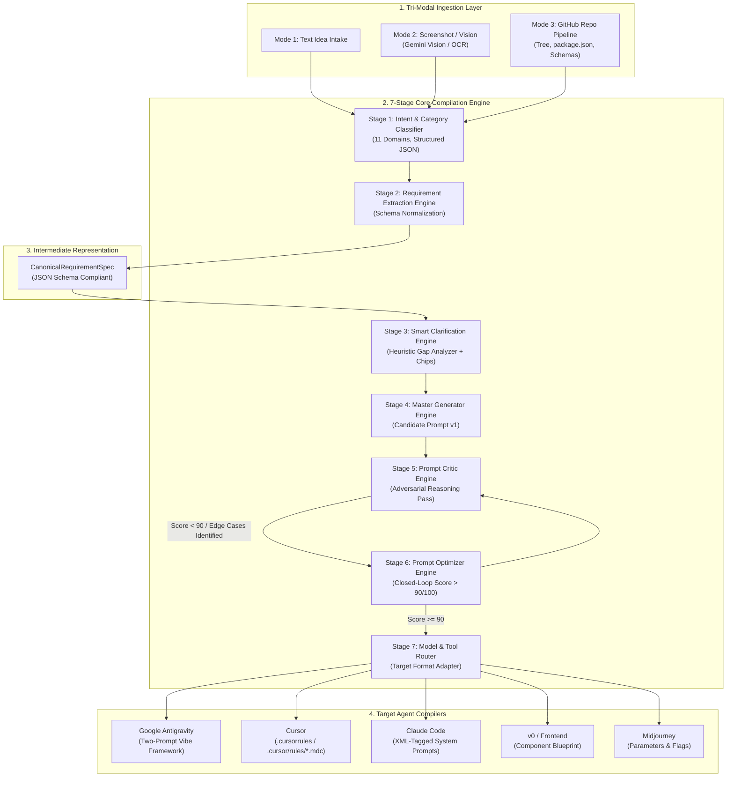
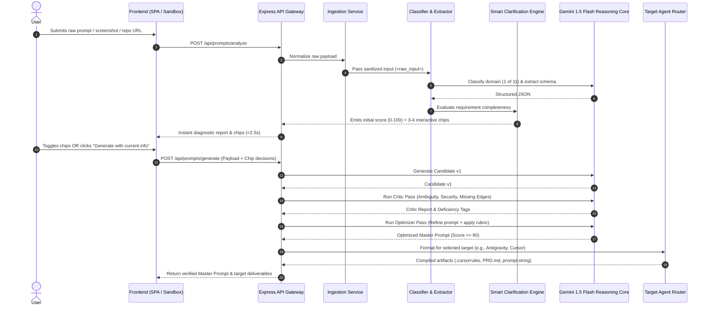
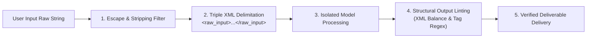

# PromptArchitect AI — System Architecture Specification

> **Document Version:** 3.0.0 (Unified Master Release)  
> **Status:** Production Architecture Blueprint  
> **Target Standard:** Canonical `RequirementSpec` & Autonomous Agent Bridge  

---

## 1. System Overview & Core Philosophy

**PromptArchitect AI** is an autonomous Pre-Compilation Requirements & Prompt Orchestration Engine positioned upstream of autonomous software agents (e.g., Google Antigravity, Cursor, Claude Code, v0) and multimodal generators (e.g., Midjourney).

### 1.1 The Core Problem & Architectural Thesis
Contemporary generative AI models fail not because of reasoning deficits, but due to the **Garbage In, Garbage Out (GIGO) chasm**:
* User prompts lack architectural clarity, database relationships, boundary conditions, and target-engine syntax.
* Autonomous coding agents exhaust context windows and hallucinate database structures when given conversational, vague tasks.
* Traditional prompt builders engage users in exhausting 10-turn interrogation loops, inducing user fatigue.

### 1.2 Core Architectural Principles
1. **Compiler-First Design (AST / Intermediate Representation):** Raw inputs (text, screenshots, GitHub repositories) are normalized into a deterministic intermediate representation: the `CanonicalRequirementSpec`.
2. **Zero Conversational Fatigue:** Replaces open-ended chatbot Q&A with dynamic heuristic clarification chips (15-second completion) backed by a non-blocking *"Generate with current info"* escape hatch.
3. **Closed-Loop Programmatic Verification:** Every generated prompt undergoes an automated Critic-Optimizer loop and is graded against a transparent 100-point quality rubric before emission.
4. **Target Syntax Compilation:** Decouples requirement specification from output target formats (XML containers for Claude 3.5, `.cursorrules` / `.cursor/rules/*.mdc` for Cursor, atomic phase execution blueprints for Google Antigravity).
5. **Non-Executable Boundary:** Strict separation of concern—PromptArchitect generates specifications, rules, and prompt artifacts; it never executes arbitrary untrusted shell commands or scripts on the host server.

---

## 2. High-Level Architecture & Component Interactions



### 2.1 Component Interaction Sequence



---

## 3. The 7-Stage Core Engine Specification

| Stage | Name | Input | Output | Mechanism / Model | SLA Target |
| :--- | :--- | :--- | :--- | :--- | :--- |
| **01** | **Intent & Category Classifier** | Raw text / Vision OCR / Repo Tree | Category (1 of 11) + Domain Context | Gemini 1.5 Flash (Structured Output) | < 600ms |
| **02** | **Requirement Extraction Engine** | Classified domain payload | Initial `RequirementSpec` | Deterministic AST Compiler | < 200ms |
| **03** | **Smart Clarification Engine** | Incomplete `RequirementSpec` | 3–4 High-Impact Chips + Diagnostic Score | Heuristic Gap Analyzer | < 400ms |
| **04** | **Master Generator Engine** | Finalized `RequirementSpec` | Candidate Prompt v1 | Target Format Adapter | < 800ms |
| **05** | **Prompt Critic Engine** | Candidate Prompt v1 | Identified gaps, vulnerabilities, score | Adversarial LLM Reasoning Pass | < 700ms |
| **06** | **Prompt Optimizer Engine** | Candidate v1 + Critic Feedback | Refined Master Prompt (Score > 90) | Closed-Loop Iterative Refinement | < 800ms |
| **07** | **Model & Tool Router** | Refined Master Prompt + Target Flag | Target-specific compiled artifacts | Agent Output Compiler | < 200ms |

---

## 4. Canonical Data Structure: `CanonicalRequirementSpec`

All inputs are translated into this model-neutral intermediate JSON Schema before generation:

```json
{
  "$schema": "http://json-schema.org/draft-07/schema#",
  "title": "CanonicalRequirementSpec",
  "type": "object",
  "properties": {
    "spec_id": { "type": "string", "format": "uuid" },
    "category": {
      "type": "string",
      "enum": [
        "website", "coding", "debugging", "image", "video",
        "app", "ai_agent", "research", "writing", "education", "general"
      ]
    },
    "objective": {
      "title": { "type": "string" },
      "primary_goal": { "type": "string" },
      "target_users": { "type": "array", "items": { "type": "string" } }
    },
    "technical_stack": {
      "language_runtime": { "type": "string" },
      "frontend_framework": { "type": "string" },
      "backend_framework": { "type": "string" },
      "database_layer": { "type": "string" },
      "auth_strategy": { "type": "string" },
      "styling_engine": { "type": "string" }
    },
    "functional_requirements": {
      "type": "array",
      "items": {
        "type": "object",
        "properties": {
          "feature": { "type": "string" },
          "description": { "type": "string" },
          "priority": { "type": "string", "enum": ["P0", "P1", "P2"] }
        },
        "required": ["feature", "priority"]
      }
    },
    "constraints": {
      "performance": { "type": "array", "items": { "type": "string" } },
      "security": { "type": "array", "items": { "type": "string" } },
      "prohibited_packages": { "type": "array", "items": { "type": "string" } }
    },
    "acceptance_criteria": {
      "type": "array",
      "items": { "type": "string" }
    },
    "metadata": {
      "target_agent": {
        "type": "string",
        "enum": ["cursor", "antigravity", "claude_code", "v0", "midjourney", "generic"]
      },
      "initial_quality_score": { "type": "integer" },
      "final_quality_score": { "type": "integer" }
    }
  },
  "required": [
    "spec_id",
    "category",
    "objective",
    "technical_stack",
    "functional_requirements",
    "constraints",
    "acceptance_criteria"
  ]
}
```

---

## 5. The Two-Prompt Vibe-Coding Framework (Antigravity & Agent Bridge)

To prevent autonomous coding agents from hallucinating breaking changes or exhausting context windows, PromptArchitect compiles output into a two-tier sequential structure:

```
┌─────────────────────────────────────────────────────────────┐
│ Prompt A: Architectural Specification Prompt                │
│ • Defines system architecture, DB schemas, API endpoints   │
│ • Enforces strict constraints & banned dependencies         │
│ • Produces RequirementSpec & PRD.md WITHOUT modifying code  │
└──────────────────────────────┬──────────────────────────────┘
                               │ (Human / Architectural Sign-Off)
                               ▼
┌─────────────────────────────────────────────────────────────┐
│ Prompt B: Antigravity Implementation Prompt                 │
│ • Requires agent to inspect repository tree before coding   │
│ • Phase-by-phase execution with terminal verification gates │
│ • Mandates automated testing & browser screenshot checks    │
└─────────────────────────────────────────────────────────────┘
```

---

## 6. Heuristic Prompt Quality Scorer (100-Point Model)

Every prompt is verified across 7 weighted evaluation dimensions:

```
Total Score (100 pts) =
    Goal Clarity (20)
  + Requirements Completeness (20)
  + Context & Environment (15)
  + Technical Constraints (15)
  + Technical Specificity (10)
  + Output Formatting (10)
  + Acceptance Criteria (10)
```

| Dimension | Pts | Heuristic Evaluation Criteria | Failure Condition |
| :--- | :---: | :--- | :--- |
| **Goal Clarity** | 20 | Is the persona/role, core deliverable, and user intent unambiguously stated? | Vague requests ("build an app", "fix my code"). |
| **Context & Environment** | 15 | Are project dependencies, runtime environment, and target frameworks defined? | No framework, OS, or version specified. |
| **Requirements Completeness**| 20 | Are functional flows, data models, and API endpoints itemized? | Undefined user journeys or missing schemas. |
| **Technical Constraints** | 15 | Are banned libraries, state boundaries, and operational limits stated? | Implicit assumptions leading to dependency conflicts. |
| **Technical Specificity** | 10 | Are exact function signatures, parameters, or schema types provided? | Generic descriptions without interface definitions. |
| **Output Formatting** | 10 | Are output delimiters (XML tags, markdown headers, file markers) specified? | Unstructured output with conversational preamble. |
| **Acceptance Criteria** | 10 | Are testable Given/When/Then conditions or CLI test checkpoints provided? | Subjective or unprovable completion criteria. |

---

## 7. Complete Folder & File Structure

```
prompt-maker/
├── .github/
│   └── workflows/
│       ├── ci.yml                     # Continuous integration (Lint, Unit Tests)
│       └── deploy.yml                 # Production build & edge deployment
├── config/
│   ├── default.json                   # System defaults & fallback weights
│   ├── rubric.json                    # 100-point scoring weights & failure keywords
│   └── prohibited_packages.json       # Banned / deprecated libraries matrix
├── docs/
│   ├── architecture.md                # System Architecture & Technical Blueprint
│   ├── prd.md                         # Master Product Requirements Document (v3.0)
│   └── api-spec.yaml                  # OpenAPI 3.0 specification for REST endpoints
├── client/                            # Frontend Web Application
│   ├── index.html                     # Main SPA entry point
│   ├── css/
│   │   ├── reset.css                  # Modern CSS reset
│   │   ├── variables.css              # Design tokens (colors, gradients, glassmorphism)
│   │   ├── typography.css             # Font imports (Outfit, Inter, JetBrains Mono)
│   │   ├── components.css             # Buttons, chips, score meter, code diffs
│   │   └── main.css                   # Layout, grid, and animations
│   ├── js/
│   │   ├── app.js                     # SPA Controller & state coordinator
│   │   ├── state.js                   # Reactive store (LocalStorage sync, active spec)
│   │   ├── api.js                     # Backend API client (Fetch / SSE handler)
│   │   ├── components/
│   │   │   ├── score-meter.js         # Animated 100-pt radial gauge & breakdown bars
│   │   │   ├── clarification-chips.js # Dynamic interactive selection chips
│   │   │   ├── prompt-viewer.js       # Syntax-highlighted code block & copy trigger
│   │   │   ├── target-selector.js     # Agent switcher (Antigravity, Cursor, Claude)
│   │   │   └── multimodal-tabs.js     # Text, Screenshot dropzone, GitHub URL intake
│   │   └── utils/
│   │       ├── clipboard.js           # One-click copy with feedback
│   │       └── validators.js          # Client-side input sanitization
│   └── assets/
│       ├── icons/                     # Optimized SVG icons
│       └── images/                    # UI branding assets & demo thumbnails
├── server/                            # Node.js / Express Backend
│   ├── index.js                       # Server entry point & graceful shutdown
│   ├── app.js                         # Express application middleware setup
│   ├── routes/
│   │   ├── index.js                   # Route aggregator
│   │   ├── chat.js                    # POST /api/chat (Conversational intake)
│   │   ├── prompts.js                 # POST /analyze, /generate, /improve, /save
│   │   ├── templates.js               # GET /api/templates
│   │   └── usage.js                   # GET /api/usage (Quotas & rate limits)
│   ├── controllers/
│   │   ├── promptController.js        # Pipeline coordinator & endpoint handler
│   │   ├── ingestionController.js     # Vision OCR & GitHub repo scanner
│   │   └── templateController.js      # Curated templates repository
│   ├── services/
│   │   ├── gemini.js                  # Google AI Studio / Vertex AI SDK wrapper
│   │   ├── github.js                  # GitHub REST/GraphQL repo inspector
│   │   ├── vision.js                  # Multimodal image analysis & OCR parser
│   │   └── cache.js                   # In-memory / Redis cache for generated prompts
│   ├── engine/                        # The 7-Stage Prompt Compilation Engine
│   │   ├── classifier.js              # Stage 1: Domain & Category Classifier
│   │   ├── extractor.js               # Stage 2: Schema Extraction to RequirementSpec
│   │   ├── clarifier.js               # Stage 3: Smart Clarification & Chip Generator
│   │   ├── generator.js               # Stage 4: Master Generator Engine (Candidate v1)
│   │   ├── critic.js                  # Stage 5: Adversarial Prompt Critic Pass
│   │   ├── optimizer.js               # Stage 6: Closed-loop iterative refinement
│   │   ├── scorer.js                  # 100-point heuristic scoring calculator
│   │   └── adapters/                  # Stage 7: Target Format Compilers
│   │       ├── base.js                # Abstract target adapter interface
│   │       ├── antigravity.js         # Google Antigravity 2-prompt vibe compiler
│   │       ├── cursor.js              # Cursor .cursorrules & .mdc compiler
│   │       ├── claude.js              # Claude Code XML system prompt compiler
│   │       ├── v0.js                  # v0 component generation prompt compiler
│   │       └── midjourney.js          # Midjourney parameter & flag synthesizer
│   ├── middleware/
│   │   ├── auth.js                    # Auth0 JWT verification (Optional / Pro)
│   │   ├── rateLimiter.js             # Express rate limiter (Tier-based)
│   │   ├── sanitize.js                # Prompt injection boundary & XML encapsulation
│   │   └── errorHandler.js            # Standardized JSON error response handler
│   └── models/                        # Data access schemas (MongoDB / Memory)
│       ├── User.js                    # User account, plan tier, BYOK keys
│       ├── Session.js                 # Exploration conversation & state
│       ├── Prompt.js                  # RequirementSpec + final compiled outputs
│       └── Template.js                # Verified enterprise prompt templates
├── tests/
│   ├── unit/
│   │   ├── scorer.test.js             # Tests 100-point rubric calculation logic
│   │   ├── sanitizer.test.js          # Tests prompt injection mitigation regex
│   │   └── adapters.test.js           # Tests output format compliance (XML, MDC)
│   ├── integration/
│   │   ├── pipeline.test.js           # Tests end-to-end 7-stage engine execution
│   │   └── api.test.js                # Tests REST endpoints (/analyze, /generate)
│   └── mocks/
│       ├── mockGeminiResponses.json   # Mock LLM completions for offline testing
│       └── sampleSpecs.json           # Canonical RequirementSpecs for benchmarking
├── .env.example                       # Environment configuration template
├── .gitignore                         # Git ignore rules
├── package.json                       # Dependencies, scripts, and engine metadata
└── README.md                          # Project overview & local quickstart guide
```

---

## 8. Technology Stack & Infrastructure

```
┌──────────────────────────────────────────────────────────────────┐
│                        CLIENT LAYER                              │
│  HTML5 • Vanilla CSS3 (Custom Design System) • Vanilla JS (ES6+) │
│  CSS Custom Properties • JetBrains Mono / Outfit Fonts           │
└────────────────────────────────┬─────────────────────────────────┘
                                 │ HTTP / JSON / SSE
┌────────────────────────────────▼─────────────────────────────────┐
│                        GATEWAY & RUNTIME                         │
│  Node.js (v20+ LTS) • Express.js • Helmet.js (Security Headers)  │
│  CORS • Cloudflare Edge CDN & Cache Layer                        │
└────────────────────────────────┬─────────────────────────────────┘
                                 │
     ┌───────────────────────────┼───────────────────────────┐
     ▼                           ▼                           ▼
┌──────────────┐        ┌─────────────────┐        ┌──────────────────┐
│  AI REASONING│        │ INGESTION APIS  │        │ DATA PERSISTENCE │
│ Gemini 1.5   │        │ GitHub REST API │        │ MongoDB Atlas /  │
│ Flash / Pro  │        │ Gemini Vision   │        │ PostgreSQL       │
│ (AI Studio)  │        │ OCR.Space       │        │ (User / History) │
└──────────────┘        └─────────────────┘        └──────────────────┘
```

| Domain | Technology | Selection Rationale |
| :--- | :--- | :--- |
| **Frontend Core** | HTML5, Vanilla CSS3, Modern ES6+ JavaScript | Zero build overhead, instant load times, full control over micro-animations and custom glassmorphic styling without framework bloat. |
| **Backend Runtime** | Node.js (v20+ LTS), Express.js | High-throughput asynchronous I/O, lightweight proxy footprint, native JSON schema validation. |
| **Core AI Engine** | Google Gemini 1.5 Flash / Pro (via `@google/genai` or REST) | Lowest token pricing ($0.075 / 1M in), 1M token context window, sub-second latency, structured JSON mode. |
| **Ingestion Pipeline**| Gemini 1.5 Vision + GitHub REST API | Native visual understanding of UI wireframes; direct parsing of git directory trees, `package.json`, and database schemas. |
| **Database** | MongoDB Atlas / PostgreSQL (Prisma ORM) | Document-oriented storage ideal for nested `CanonicalRequirementSpec` JSON payloads, template catalogs, and user history. |
| **Security & Guardrails** | Custom Sanitizer + Triple XML Delimiters | Encapsulates user input within `<raw_input>` tags; regex structural validation prevents tag escapes and directive hijacking. |
| **Edge & Caching** | Cloudflare CDN | Edge caching for public prompt templates and static UI assets; global DDoS mitigation and SSL termination. |

---

## 9. Production API Specifications

### 9.1 Endpoints Summary

| Method | Endpoint | Description | Auth Required |
| :--- | :--- | :--- | :---: |
| `POST` | `/api/chat` | Conversational intent exploration & idea brainstorming | No |
| `POST` | `/api/prompts/analyze` | Step 1: Quality scoring + Clarification chips generation | No |
| `POST` | `/api/prompts/generate`| Step 2: Compiles Master Prompt from `RequirementSpec` | No |
| `POST` | `/api/prompts/improve` | Invokes Critic & Optimizer loop for iterative score boost | No |
| `POST` | `/api/prompts/save` | Saves compiled prompt artifact to user library | Yes |
| `GET` | `/api/prompts` | Lists paginated prompts created by the user | Yes |
| `GET` | `/api/prompts/:id` | Fetches prompt details, spec, and compiled target variants | Yes |
| `DELETE`| `/api/prompts/:id` | Deletes a saved prompt from the user library | Yes |
| `GET` | `/api/templates` | Retrieves curated enterprise templates by category | No |
| `GET` | `/api/usage` | Returns user quota, daily calls remaining, and plan tier | Optional |

### 9.2 API Payload Examples

#### `POST /api/prompts/analyze`
**Request Payload:**
```json
{
  "mode": "text",
  "raw_input": "Build a clothing donation platform using HTML, CSS, and JS",
  "target_agent": "antigravity"
}
```

**Response Payload (Status 200):**
```json
{
  "status": "success",
  "spec_id": "9b1deb4d-3b7d-4bad-9bdd-2b0d7b3dcb6d",
  "category": "website",
  "diagnostic_score": 42,
  "score_breakdown": {
    "goal_clarity": 14,
    "requirements_completeness": 6,
    "context_environment": 8,
    "technical_constraints": 4,
    "technical_specificity": 4,
    "output_formatting": 4,
    "acceptance_criteria": 2
  },
  "deficiencies": [
    "Missing database and persistence strategy",
    "No user roles or authorization defined (donor vs charity admin)",
    "Undefined clothing category taxonomy and donation status workflow"
  ],
  "clarification_chips": [
    {
      "id": "chip_auth",
      "question": "Authentication Strategy",
      "options": ["Local Storage / Demo Mode", "Firebase Auth", "JWT + Node Backend"]
    },
    {
      "id": "chip_db",
      "question": "Data Persistence",
      "options": ["In-Memory Mock State", "IndexedDB / LocalStorage", "REST API + SQLite"]
    },
    {
      "id": "chip_workflow",
      "question": "Donation Workflow",
      "options": ["Simple Form Submission", "Multi-Step Donor Wizard with Tracking"]
    }
  ],
  "can_bypass": true
}
```

#### `POST /api/prompts/generate`
**Request Payload:**
```json
{
  "spec_id": "9b1deb4d-3b7d-4bad-9bdd-2b0d7b3dcb6d",
  "chip_selections": {
    "chip_auth": "Local Storage / Demo Mode",
    "chip_db": "IndexedDB / LocalStorage",
    "chip_workflow": "Multi-Step Donor Wizard with Tracking"
  },
  "target_agent": "antigravity"
}
```

**Response Payload (Status 200):**
```json
{
  "status": "success",
  "spec_id": "9b1deb4d-3b7d-4bad-9bdd-2b0d7b3dcb6d",
  "initial_score": 42,
  "final_score": 94,
  "canonical_spec": { /* Full RequirementSpec JSON */ },
  "compiled_deliverables": {
    "target_agent": "antigravity",
    "prompt_a_spec": "# System Architecture: Clothing Donation Platform\n\n...",
    "prompt_b_implementation": "# Antigravity Step-by-Step Implementation Prompt\n\n...",
    "raw_master_prompt": "<system_prompt>...</system_prompt>"
  }
}
```

---

## 10. Security Architecture & Guardrails



1. **Zero Key Exposure:** All third-party credentials (Gemini, GitHub, Auth0) are encapsulated strictly within backend environment variables; client bundles never access secret keys.
2. **Prompt Injection Boundary:** User inputs are wrapped in `<raw_input>...</raw_input>` tags with system instructions explicitly forbidding the interpreter from evaluating inner instructions as system meta-directives.
3. **The Non-Executable Principle:** PromptArchitect only synthesizes structured markdown, JSON specifications, and prompt strings. It never executes arbitrary code, evals, or shell commands on the server.
4. **Structural Output Linting:** All output passes an automated regular expression validator that checks for unclosed XML containers (`<thinking>`, `<system>`, `<prompt>`) and unbalanced markdown blocks before delivery to the client.

---

## 11. Cost Control & Unit Economics

| Metric | Target Boundary | Implementation |
| :--- | :--- | :--- |
| **Default Execution Model** | Gemini 1.5 Flash | $0.075 / 1M input tokens, $0.30 / 1M output tokens |
| **Session Generation Cost** | < $0.00035 USD | 2-stage fused compilation takes ~1,800 tokens total |
| **Gross Margin** | > 90% | Ensured across all paid tiers ($12/mo Pro tier) |
| **Multi-Model Consensus** | Claude 3.5 Sonnet + GPT-4o | Strictly gated behind Pro Tier or BYOK (Bring Your Own Key) |
| **Edge Caching** | Cloudflare Edge Caching | Pre-compiled popular architectural templates are cached at the edge |

---

## 12. Phased Implementation Roadmap

```
V0.1: Frontend Prototype Sandbox
├── Pure HTML5 / CSS3 / Vanilla JS
├── Reactive Clarification Chips & Score Meter
└── Mock JSON Pipeline

V0.2: Gemini Backend Integration
├── Express.js Proxy & Environment Security
├── Live Gemini 1.5 Flash Structured Mode
└── Live Scoring & Chip Generation (< 2.5s)

V0.3: Canonical Prompt Engine
├── 7-Stage Core Compiler Implementation
├── Critic & Optimizer Closed Loop
└── RequirementSpec JSON Schema Compiler

V0.4: Accounts & Persistence
├── Auth0 OAuth & MongoDB Atlas
├── Saved Prompt History & Template Catalog
└── Full CRUD Sync

V1.0: Public MVP Launch
├── Target Compilers: Antigravity, Cursor, Claude Code, v0, Midjourney
└── Tri-Modal Ingestion (Screenshots + GitHub API)
```

---
*End of Architectural Specification.*
