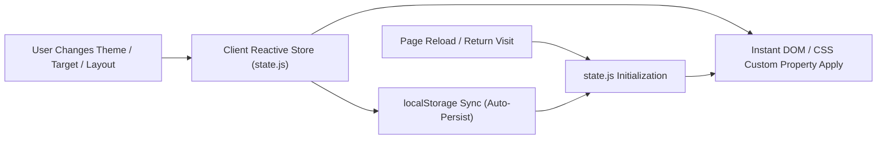

# PromptArchitect AI — UI/UX Design System & Visual Guidelines

> **Document:** `design.md`  
> **Document Version:** 3.0.0  
> **Target Standard:** Visual Excellence, Micro-Interactions & Accessible Design  
> **Alignment:** Master PRD v3.0, [architecture.md](file:///d:/prompt%20maker/architecture.md), and [rules.md](file:///d:/prompt%20maker/rules.md)  

---

## 1. UI/UX Principles & Experience Architecture

PromptArchitect AI is built for software engineers, vibe coders, and technical creators. The interface prioritizes **zero conversational fatigue, instant feedback, and maximum architectural clarity**.

```
┌────────────────────────────────────────────────────────────────────────┐
│                          PROMPTARCHITECT APP                           │
├────────────────────────────────┬───────────────────────────────────────┤
│  1. Ingestion Control Bar      │  2. Diagnostic Score HUD & Chips      │
│  [Text] [Screenshot] [GitHub]  │  (100-Point Radial Gauge + Chips)     │
│  Input Area + Escape Hatch     │  Goal • Tech • Bounds • Acceptance    │
├────────────────────────────────┴───────────────────────────────────────┤
│  3. Two-Prompt Split Stage & Deliverables Compiler                     │
│  ┌─────────────────────────────────┬─────────────────────────────────┐ │
│  │ Prompt A: Architecture Blueprint│ Prompt B: Agent Implementation  │ │
│  │ (PRD.md & Canonical Spec)       │ (Terminal Gates & Step Prompts) │ │
│  └─────────────────────────────────┴─────────────────────────────────┘ │
└────────────────────────────────────────────────────────────────────────┘
```

### 1.1 Clean and Intuitive Interface
* **Task-First Layout:** The primary workspace immediately displays the input on-ramps without decorative fluff or lengthy tutorials.
* **Instant Diagnostic Feedback:** Typing a prompt immediately triggers heuristic classification and activates the animated score meter.
* **Non-Blocking Clarification:** Missing architectural parameters are presented as 3–4 interactive selection chips rather than blocking question modals. A persistent *"Generate with current info"* button guarantees users are never trapped.

### 1.2 Consistent User Experience
* **Unified Visual Language:** Identical pill radius (`9999px`), surface cards (`rounded-xl` / `16px`), glass borders (`1px solid rgba(255, 255, 255, 0.08)`), and shadow depths across all views.
* **Predictable Micro-Interactions:**
  * Interactive elements scale down slightly on active press (`transform: scale(0.98)`).
  * Hovering over chips and action buttons activates subtle glow effects (`box-shadow: 0 0 16px rgba(99, 102, 241, 0.25)`).
  * Copy triggers provide immediate visual feedback (icon morphs from clipboard to checkmark with green badge toast).

### 1.3 Mobile-First & Responsive Approach
* **Fluid Grid System:** Designed mobile-first using pure CSS Grid and Flexbox:
  * **Mobile (< 768px):** Single vertical stream. The diagnostic score gauge collapses into a top status bar; the Two-Prompt output view displays as toggleable tabs (`[Prompt A] [Prompt B]`).
  * **Tablet (768px – 1024px):** Stacked hero section with side-by-side prompt previews.
  * **Desktop (> 1024px):** Full dual-column workspace: left column for Ingestion + Clarification Chips; right column for Live Diagnostics + Two-Prompt Compiler.
  * **Ultra-Wide (> 1440px):** 3-column layout featuring persistent Prompt Library Drawer on the left, workspace in the center, and Canonical JSON Inspector on the right.

### 1.4 Accessibility & Navigation (WCAG 2.1 AA Compliant)
* **High-Contrast Text Ratios:** Minimum contrast ratio of 4.5:1 for body text and 7:1 for headers against dark backgrounds.
* **Keyboard Navigable:** Full `Tab` focus flow with visible high-visibility focus rings (`outline: 2px solid var(--accent-cyan); outline-offset: 2px;`).
* **Screen Reader Semantic Hierarchy:** Strictly one `<h1>` per page, descriptive `aria-label` tags on all icon-only buttons, and `aria-live="polite"` on the dynamic score meter.

### 1.5 Component Reuse & Modularity
* Independent CSS modules (`variables.css`, `components.css`, `main.css`).
* Reusable Web Components: `<score-meter>`, `<clarification-chips>`, `<prompt-viewer>`, `<target-selector>`, and `<toast-notification>`.

---

## 2. Color System & Theming

The application defaults to a **Cyber-Obsidian Dark Mode** engineered for developer ergonomics during extended night coding sessions, with a high-clarity **Paper-Clean Light Mode** fallback.

```
DARK THEME (Default)
  [ #0A0D14 ]  Dark Obsidian Background
  [ #111726 ]  Glass Surface Card
  [ #1E293B ]  Subtle Border Stroke
  [ #6366F1 ]  Neon Indigo (Primary)
  [ #8B5CF6 ]  Violet Gradient Accent
  [ #06B6D4 ]  Electric Cyan (Interactive Accent)
  [ #10B981 ]  Success Emerald
  [ #F59E0B ]  Warning Amber
  [ #EF4444 ]  Danger Crimson
```

### 2.1 Color Palette Tokens (CSS Custom Properties)

```css
:root[data-theme="dark"] {
  /* Brand & Primary Accents */
  --primary-500: #6366f1;           /* Neon Indigo */
  --primary-400: #818cf8;
  --primary-600: #4f46e5;
  --primary-gradient: linear-gradient(135deg, #6366f1 0%, #8b5cf6 50%, #d946ef 100%);
  
  /* Secondary & Interactive */
  --accent-cyan: #06b6d4;            /* Electric Cyan (Focus & High-leverage) */
  --accent-cyan-glow: rgba(6, 182, 212, 0.25);
  --accent-purple: #8b5cf6;          /* Secondary Accent */

  /* Backgrounds & Surfaces (Glassmorphism) */
  --bg-app: #080b11;                 /* Cyber-Obsidian deepest canvas */
  --bg-surface: #0f1523;             /* Primary card background */
  --bg-surface-elevated: #161e31;    /* Popovers, modals, dropdowns */
  --bg-surface-glass: rgba(15, 21, 35, 0.75); /* Glass surface with blur */
  --backdrop-blur: blur(12px);

  /* Borders & Dividers */
  --border-subtle: #1e293b;          /* Standard structural border */
  --border-glass: rgba(255, 255, 255, 0.08); /* Highlight border on cards */
  --border-active: rgba(99, 102, 241, 0.5);

  /* Typography Colors */
  --text-primary: #f8fafc;          /* High-contrast headers & active items */
  --text-secondary: #94a3b8;        /* Body text, descriptions */
  --text-muted: #64748b;            /* Placeholders, disabled states */
  --text-inverse: #0f172a;          /* Inverted text on bright badges */

  /* Semantic Feedback Colors */
  --status-success: #10b981;        /* Score >= 85, verified tags */
  --status-success-bg: rgba(16, 185, 129, 0.12);
  --status-warning: #f59e0b;        /* Score 50-84, missing constraints */
  --status-warning-bg: rgba(245, 158, 11, 0.12);
  --status-danger: #ef4444;         /* Score < 50, critical gaps, error */
  --status-danger-bg: rgba(239, 68, 68, 0.12);
  --status-info: #0ea5e9;           /* Informational notices */
}

:root[data-theme="light"] {
  /* Light Theme Overrides */
  --bg-app: #f8fafc;
  --bg-surface: #ffffff;
  --bg-surface-elevated: #f1f5f9;
  --bg-surface-glass: rgba(255, 255, 255, 0.85);
  --border-subtle: #e2e8f0;
  --border-glass: rgba(0, 0, 0, 0.06);
  --border-active: rgba(99, 102, 241, 0.6);
  --text-primary: #0f172a;
  --text-secondary: #475569;
  --text-muted: #94a3b8;
  --text-inverse: #ffffff;
  --primary-gradient: linear-gradient(135deg, #4f46e5 0%, #7c3aed 100%);
}
```

### 2.2 Score Gauge Diagnostic Color Mapping
The 100-point score meter dynamically changes color based on the heuristic value:
* **0 – 49 Points (Critical Deficiency):** Crimson `--status-danger` (`#ef4444`) with pulsing warning icon.
* **50 – 84 Points (Partial Specification):** Amber `--status-warning` (`#f59e0b`).
* **85 – 100 Points (Production Ready):** Emerald `--status-success` (`#10b981`) with glowing circular track.

---

## 3. Fonts & Typography System

The typography hierarchy uses three carefully paired Google Fonts to separate brand identity, user interface readability, and structured code/prompts.

```
┌────────────────────────────────────────────────────────────────────────┐
│ TYPOGRAPHY STACK                                                       │
│                                                                        │
│ Outfit         Aa Bb Gg 123   (Display Headers, Badges, Score HUD)     │
│ Inter          Aa Bb Gg 123   (Body Text, Labels, Form Inputs, Buttons)│
│ JetBrains Mono 01 23 <> {} == (XML Containers, Prompts, JSON Schemas)  │
└────────────────────────────────────────────────────────────────────────┘
```

### 3.1 Font Family Tokens
```css
--font-display: 'Outfit', -apple-system, BlinkMacSystemFont, sans-serif;
--font-sans: 'Inter', -apple-system, BlinkMacSystemFont, sans-serif;
--font-mono: 'JetBrains Mono', 'Fira Code', monospace;
```

### 3.2 Typography Scale & Hierarchy

| Role | Font Family | Size (rem / px) | Weight | Line Height | Tracking |
| :--- | :--- | :--- | :--- | :--- | :--- |
| **Display H1** | Outfit | `2.5rem` / 40px | 800 (ExtraBold) | 1.15 | `-0.025em` |
| **Section H2** | Outfit | `1.75rem` / 28px| 700 (Bold) | 1.25 | `-0.02em` |
| **Card H3** | Outfit | `1.25rem` / 20px| 600 (SemiBold) | 1.35 | `-0.015em` |
| **Label / Eyebrow**| Outfit | `0.75rem` / 12px| 700 (Bold) | 1.4 | `+0.08em` (UPPERCASE) |
| **Score HUD Value**| Outfit | `3.5rem` / 56px | 800 (ExtraBold) | 1.0 | `-0.03em` |
| **Body Large** | Inter | `1.125rem` / 18px| 400 (Regular) | 1.6 | `normal` |
| **Body Standard**| Inter | `0.9375rem` / 15px| 400 (Regular) | 1.55 | `normal` |
| **Body Small** | Inter | `0.8125rem` / 13px| 400 (Regular) | 1.5 | `normal` |
| **Button / Chip**| Inter | `0.875rem` / 14px| 500 (Medium) | 1.0 | `+0.01em` |
| **Code / Prompts**| JetBrains Mono| `0.875rem` / 14px| 400 (Regular) | 1.6 | `normal` |

### 3.3 Typography Formatting Rules
* **Code Blocks:** Syntax highlighted with line numbers, custom scrollbars, and monospace styling.
* **Heading Gradients:** Display H1 utilizes the primary gradient clipped to text (`background: var(--primary-gradient); -webkit-background-clip: text; -webkit-text-fill-color: transparent;`).
* **Tags & Badges:** `text-transform: uppercase`, tracking `+0.05em`, font size `0.75rem`, font weight `700`.

---

## 4. Memory & UI Preference Persistence

PromptArchitect AI stores all user UI preferences locally to ensure instant return visits with zero layout shift.



### 4.1 Persisted Preference Schema

| Preference Key | Data Type | Default Value | Description |
| :--- | :--- | :--- | :--- |
| `promptarchitect_theme` | `'dark'` \| `'light'` | `'dark'` | Visual theme mode across sessions. |
| `promptarchitect_target_agent` | `string` | `'antigravity'` | Default target AI compiler (`'antigravity'`, `'cursor'`, `'claude_code'`, `'v0'`, `'midjourney'`). |
| `promptarchitect_ingest_mode` | `string` | `'text'` | Active ingestion tab (`'text'`, `'screenshot'`, `'github'`). |
| `promptarchitect_sidebar_state`| `'expanded'` \| `'collapsed'`| `'collapsed'` | Prompt library slide-over drawer state. |
| `promptarchitect_active_spec_id`| `string` (UUID) | `null` | Active draft specification id. |
| `promptarchitect_history` | `Array<Object>` | `[]` | Last 10 locally compiled prompts (spec, target, score, timestamp). |
| `promptarchitect_auto_copy` | `boolean` | `false` | Automatically copy Master Prompt to clipboard on compile completion. |

### 4.2 State Restoration Protocol
1. **Zero-Flicker Theme Initialization:** Inline script in `<head>` immediately queries `localStorage.getItem('promptarchitect_theme')` and applies `data-theme` to `document.documentElement` **before** the initial paint, eliminating white-screen flash.
2. **Graceful Fallback:** If `localStorage` is disabled, restricted (incognito iframe), or corrupted, all settings default to the Cyber-Dark standard without throwing runtime exceptions.
3. **Session Recovery:** If an unsubmitted prompt draft exists in memory, the user is offered a one-click *"Restore previous draft"* toast notification on reload.

---

## 5. UI Component Design Specifications

### 5.1 Dynamic Clarification Chips Component
* **Visual Appearance:** Compact glass pills with subtle glowing border upon selection.
* **States:**
  * `Default`: `background: var(--bg-surface-elevated); border: 1px solid var(--border-subtle); color: var(--text-secondary);`
  * `Hover`: `border-color: var(--primary-400); color: var(--text-primary); transform: translateY(-1px);`
  * `Selected`: `background: var(--primary-600); border-color: var(--primary-400); color: #ffffff; box-shadow: 0 0 12px var(--primary-500);`
* **Non-blocking Escape Hatch:** A persistent, secondary button anchored alongside the chip deck:
  ```html
  <button id="btn-bypass-chips" class="btn-ghost">
    ⚡ Generate with current info
  </button>
  ```

### 5.2 100-Point Score Gauge HUD
* **Radial SVG Gauge:** 140px diameter circular progress ring with stroke-dasharray animation (transition 600ms ease-out).
* **Breakdown Bars:** 7 horizontal micro-meter bars visualizing the rubric dimensions:
  * Goal Clarity (20)
  * Completeness (20)
  * Context & Env (15)
  * Constraints (15)
  * Specificity (10)
  * Formatting (10)
  * Acceptance Criteria (10)

### 5.3 Two-Prompt Split Stage Viewer
* **Header Bar:** Tabs with target badge, token counter badge, and one-click copy buttons.
* **Pane A (Prompt A — Architectural Spec):** Violet accent border with badge `PRD & ARCHITECTURE`.
* **Pane B (Prompt B — Agent Implementation):** Cyan accent border with badge `AUTONOMOUS AGENT BRIDGE`.
* **Copy Action:**
  ```javascript
  // Copies clean text without UI chrome and triggers 2-second checkmark toast
  copyToClipboard(promptText);
  ```

---
*End of UI/UX Design System Specification (`design.md`).*
