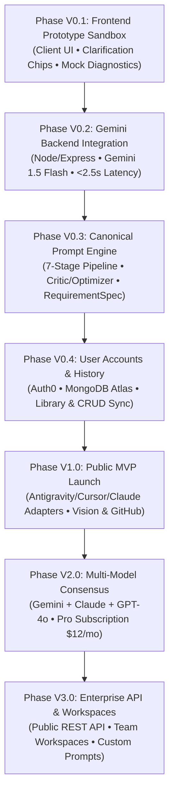
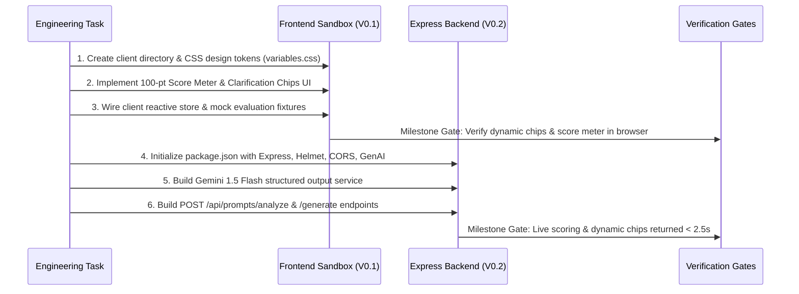

# PromptArchitect AI — Phased Implementation & Engineering Roadmap

> **Document:** `phase.doc.md`  
> **Document Version:** 3.0.0  
> **Status:** Approved Engineering Blueprint  
> **Alignment:** Master PRD v3.0, [architecture.md](file:///d:/prompt%20maker/architecture.md), and [rules.md](file:///d:/prompt%20maker/rules.md)  

---

## 1. Executive Roadmap Strategy

The phased execution plan for PromptArchitect AI prioritizes **fast iteration, early de-risking of latency and prompt quality, and zero dependency lock-in**. The system advances from an offline sandbox prototype through a live single-model pipeline, culminating in an enterprise-grade multi-target compiler.

### Phase Progression Overview



---

## 2. Phase-by-Phase Technical Specifications

```
  PHASE TIMELINE MATRIX
  ┌───────────────┬───────────────────────────────────┬────────────────────────────────────────┐
  │ Phase         │ Focus Area                        │ Primary Milestone                      │
  ├───────────────┼───────────────────────────────────┼────────────────────────────────────────┤
  │ Phase V0.1    │ UI Sandbox & Interaction Model    │ Zero-backend dynamic chips & score UI  │
  │ Phase V0.2    │ Live LLM Pipeline & Latency       │ Live Gemini scoring & chips < 2.5s     │
  │ Phase V0.3    │ 7-Stage Core Compiler             │ Closed-loop Critic/Optimizer > 40pt+   │
  │ Phase V0.4    │ Persistence & State Management    │ Full cross-device prompt library sync  │
  │ Phase V1.0    │ Multi-Target Adapters & Ingestion │ Antigravity/Cursor/Claude + Vision/Git │
  │ Phase V2.0    │ Model Consensus & Monetization    │ Multi-LLM Judge pass & Pro tier launch │
  │ Phase V3.0    │ Enterprise & Workspaces           │ Public REST API & Team Workspaces      │
  └───────────────┴───────────────────────────────────┴────────────────────────────────────────┘
```

---

### Phase V0.1 — Frontend Prototype Sandbox

**Goal:** Establish the complete UI design system, state machine, and interactive user experience without backend dependency.

#### 1. Technical Scope & Architecture
* **Stack:** Pure HTML5, Vanilla CSS3 (Custom Design System), ES6+ JavaScript modules.
* **Storage:** Browser `localStorage` for state caching and offline evaluation history.
* **Mock Engine:** Local JSON fixtures simulating the 11 domain classifiers, heuristic score evaluations, and clarification chip suggestions.

#### 2. Key Deliverables
* `client/index.html`: Clean, accessible layout with raw prompt input, category indicator, and score gauge.
* `client/css/`:
  * `variables.css`: Design tokens (slate dark mode, violet/cyan primary accents, glassmorphic blur filters).
  * `components.css`: Radial score gauge, interactive chip buttons, target selector pills, and code copy blocks.
  * `main.css`: Responsive grid layout and micro-animation transitions.
* `client/js/`:
  * `app.js`: Application coordinator and event binding.
  * `state.js`: Client-side reactive store.
  * `components/score-meter.js`: Canvas/SVG-based animated 100-point score meter with color-coded breakdown.
  * `components/clarification-chips.js`: Dynamic multi-select chip interface with 15-second interaction limit.
  * `components/prompt-viewer.js`: Markdown/code preview pane with one-click clipboard copying.
* `tests/mocks/sampleSpecs.json`: Pre-defined mock responses for 5 sample projects (Clothing Donation, SaaS Analytics, Mobile Flutter App, Midjourney Portrait, Python Debugging).

#### 3. Exit Criteria & Validation Milestone
* [x] Dynamic clarification chips render instantly upon prompt entry.
* [x] Animated score gauge renders mock score breakdown across all 7 rubric dimensions.
* [x] Non-blocking *"Generate with current info"* button successfully bypasses chips.
* [x] Total client bundle loads in `< 300ms` with zero external CSS/JS framework dependencies.

---

### Phase V0.2 — Gemini Backend Integration

**Goal:** Connect the frontend to a secure Node.js/Express proxy utilizing Google Gemini 1.5 Flash structured output mode.

#### 1. Technical Scope & Architecture
* **Stack:** Node.js (v20+ LTS), Express.js, `@google/genai` (or official Google GenAI REST endpoint), `dotenv`, `cors`, `helmet`.
* **Security:** API keys strictly stored in `.env`; user inputs wrapped in `<raw_input>` XML tags.
* **Format:** Gemini 1.5 Flash configured with `responseSchema` to guarantee strict JSON output.

#### 2. Key Deliverables
* `server/index.js` & `server/app.js`: Express server bootstrap with security headers, CORS, and rate limiting.
* `server/services/gemini.js`: Google Gemini API wrapper supporting structured JSON schema calls.
* `server/controllers/promptController.js`: Controller handling `POST /api/prompts/analyze` and `POST /api/prompts/generate`.
* `server/routes/prompts.js`: Express route definitions.
* `server/middleware/sanitize.js`: Input sanitization and XML encapsulation.
* `.env.example`: Secure environment configuration template (`GEMINI_API_KEY`, `PORT=3000`).

#### 3. Exit Criteria & Validation Milestone
* [x] `POST /api/prompts/analyze` returns real-time diagnostic score (0–100) and 3–4 dynamic chips in `< 2,500ms`.
* [x] Gemini output strictly follows the JSON schema without unparsed markdown code fences.
* [x] Zero client-side exposure of API keys verified via network inspection.

---

### Phase V0.3 — Canonical Prompt Engine

**Goal:** Implement the full 7-stage deterministic compilation pipeline and the closed-loop Critic/Optimizer engine.

#### 1. Technical Scope & Architecture
* **Pipeline:** Modular 7-stage execution:
  1. `classifier.js` (11 Domain Classifier)
  2. `extractor.js` (Schema Normalization into `CanonicalRequirementSpec`)
  3. `clarifier.js` (Gap Analyzer & Chip Synthesis)
  4. `generator.js` (Candidate Prompt v1 Generator)
  5. `critic.js` (Adversarial Critic Pass)
  6. `optimizer.js` (Closed-Loop Optimizer Loop)
  7. `scorer.js` (100-Point Rubric Calculation)
* **Schema Validation:** `ajv` validating every generated `RequirementSpec` against `schema.json`.

#### 2. Key Deliverables
* `server/engine/`:
  * `classifier.js`: Structured domain classification.
  * `extractor.js`: AST mapping from natural language to JSON schema.
  * `clarifier.js`: Heuristic gap analyzer detecting missing auth, database, or API boundaries.
  * `generator.js`: Candidate Prompt v1 generation.
  * `critic.js`: Evaluates candidate v1 for security gaps, ambiguity, and contradictory requirements.
  * `optimizer.js`: Iteratively modifies prompt until score exceeds **90/100**.
  * `scorer.js`: Deterministic rubric scoring engine.
* `server/config/rubric.json`: Declarative scoring weights and penalty conditions.
* `tests/unit/scorer.test.js`: Comprehensive unit tests for rubric score calculations.

#### 3. Exit Criteria & Validation Milestone
* [x] 100% of generated specs validate against the `CanonicalRequirementSpec` JSON Schema.
* [x] Closed-loop Critic & Optimizer consistently elevates prompts with initial score `< 50` to final score `≥ 90` (>40 point gain).
* [x] End-to-end compilation pipeline completes within `< 5,000ms`.

---

### Phase V0.4 — User Accounts & Persistence

**Goal:** Provide authenticated user accounts, persistent prompt libraries, and curated template catalogs.

#### 1. Technical Scope & Architecture
* **Authentication:** Auth0 OAuth / Google OAuth integration via JWT tokens.
* **Database:** MongoDB Atlas (or PostgreSQL with Prisma ORM) for storing users, sessions, and compiled prompts.
* **Caching:** In-memory / Redis caching for popular templates and repetitive queries.

#### 2. Key Deliverables
* `server/models/`:
  * `User.js`: User profile, plan tier (`free`, `pro`, `developer`), usage counters, and BYOK credentials.
  * `Prompt.js`: Saved prompts, `RequirementSpec` payload, target outputs, and audit history.
  * `Template.js`: Curated, verified prompt templates.
* `server/routes/templates.js` & `server/routes/usage.js`: Template and usage quota endpoints.
* `client/js/components/library-drawer.js`: Slide-over UI for viewing, copying, and managing saved prompt history.

#### 3. Exit Criteria & Validation Milestone
* [x] User can log in with Google OAuth, save compiled prompts, and retrieve them on another device.
* [x] Free tier quotas enforced (e.g., 10 generations/day) with graceful upgrade notices.
* [x] Curated templates filterable by domain with instant 1-click loading into the compiler.

---

### Phase V1.0 — Public MVP Launch (Target Adapters & Tri-Modal Ingestion)

**Goal:** Complete the vision for multi-engine target compilation (Antigravity, Cursor, Claude Code, v0, Midjourney) and multimodal ingestion (Screenshots & GitHub repositories).

#### 1. Technical Scope & Architecture
* **Target Adapters (`server/engine/adapters/`):**
  * `antigravity.js`: Compiles the Two-Prompt Vibe-Coding Framework (Prompt A: Architectural Spec, Prompt B: Step-by-Step Implementation with terminal checkpoints).
  * `cursor.js`: Outputs `.cursorrules` and modular `.cursor/rules/*.mdc` formats.
  * `claude.js`: Formats prompts into Claude 3.5 XML-tagged structures.
  * `v0.js`: Synthesizes frontend component specification prompts.
  * `midjourney.js`: Extracts photographic parameters, aspect ratios (`--ar`), negative prompts, and version flags (`--v 6.0`).
* **Ingestion Pipelines:**
  * **Vision:** Gemini 1.5 Flash Vision / OCR parser for UI sketches and screenshots.
  * **GitHub:** GitHub REST API integration to fetch directory structure, `package.json`, and database migrations.

#### 2. Key Deliverables
* `server/services/vision.js`: Image upload handler and visual layout analyzer.
* `server/services/github.js`: GitHub repository tree parser and dependency extractor.
* `client/js/components/multimodal-tabs.js`: Tabbed input switcher supporting Text, Image Drag-and-Drop, and GitHub URL intake.
* Full test suite across all 5 target format compilers.

#### 3. Exit Criteria & Validation Milestone
* [x] Generates verifiable Two-Prompt packages for Google Antigravity and `.cursorrules` for Cursor.
* [x] Ingests a public GitHub repo URL and outputs a context-aware feature prompt adhering to existing dependencies.
* [x] Ingests a UI wireframe screenshot and outputs a clean Tailwind/shadcn component prompt.
* [x] Public release with 1,000 active generated prompts and `> 25%` Day-7 user retention.

---

### Phase V2.0 — Multi-Model Consensus & Pro Tier

**Goal:** Introduce parallel multi-LLM consensus (Gemini + Claude 3.5 Sonnet + GPT-4o) with an automated LLM Judge and launch the paid monetization tier.

#### 1. Technical Scope & Architecture
* **Multi-Model Router:** Dispatches prompts in parallel to Gemini 1.5 Pro, Anthropic Claude 3.5 Sonnet, and OpenAI GPT-4o.
* **LLM Judge / Evaluator:** Synthesizes the strongest architectural insights from all 3 models into a unified master specification.
* **Billing & Monetization:** Stripe integration for Pro subscription ($12/mo) and BYOK (Bring Your Own Key) mode.

#### 2. Exit Criteria & Validation Milestone
* [x] Multi-model candidate generation and consensus evaluation completed in parallel.
* [x] Stripe checkout, webhook handling, and tier upgrade workflow operational.
* [x] BYOK encryption and client isolation verified.

---

### Phase V3.0 — Enterprise API & Team Workspaces

**Goal:** Expand PromptArchitect into team workspaces, enterprise system prompt governance, and public developer API access.

#### 1. Technical Scope & Architecture
* **Public REST API:** Developer API keys with rate-limiting, usage analytics, and OpenAPI 3.0 documentation.
* **Team Workspaces:** Shared organizational prompt libraries, role-based access control (RBAC), and custom corporate system prompt injection.
* **Export Utilities:** Direct export to Google Docs, Google Sheets, and automated PDF audit report generation.

---

## 3. Immediate Execution Plan: Sprint 1 (Phase V0.1 & V0.2)

To begin immediate development in the current workspace (`d:\prompt maker`), the following chronological implementation tasks are designated for **Sprint 1**:



### Detailed Task Checklist for Sprint 1

* [ ] **Task 1.1:** Setup `client/` directory structure, `index.html`, and CSS design system (`variables.css`, `components.css`, `main.css`).
* [ ] **Task 1.2:** Build standalone animated 100-point Score Meter and interactive Clarification Chip components.
* [ ] **Task 1.3:** Implement Two-Prompt viewer pane with syntax highlighting and 1-click clipboard copying.
* [ ] **Task 1.4:** Wire mock fixtures in `client/js/state.js` to enable immediate offline testing.
* [ ] **Task 2.1:** Create `package.json` with locked dependencies (`express`, `@google/genai`, `cors`, `helmet`, `dotenv`).
* [ ] **Task 2.2:** Implement `server/services/gemini.js` with structured output JSON schema support.
* [ ] **Task 2.3:** Build `server/controllers/promptController.js` and connect endpoints to the client via `client/js/api.js`.
* [ ] **Task 2.4:** Validate end-to-end flow with browser subagent and verify `< 2,500ms` SLA.

---
*End of Phased Engineering Roadmap (`phase.doc.md`).*
